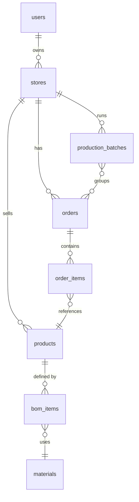

# Lemmary API

> Automated reporting for small businesses.

Pulls orders from commerce platforms, normalizes them against a bill of materials, and generates production schedules, materials demand, and time-series analytics.

**[Live demo →](https://lemmary.com)** — sample data reseeds nightly via a scheduled job so order and due dates always stay current.

## Stack

Fastify · Kysely · PostgreSQL (Supabase) · Zod · TypeScript

## Highlights

- Aggregates raw orders into KPIs — revenue, lead time, completion rates — with time-series trends across daily, weekly, and monthly buckets and period-over-period comparisons
- Joins orders against a bill of materials to roll up total materials demand and cut lists per production batch — shared logic in [`batch-aggregation.ts`](server/utils/batch-aggregation.ts)
- Platform adapter pattern for storefronts. Currently integrated with Squarespace (Shopify and Etsy pending)
- Read-only demo mode so anyone can explore the full app with sample data — no signup required
- Unhandled errors are captured to Sentry in production for observability

## SQL

A few of the more interesting analytics queries are written up in [`docs/sql-showcase.md`](docs/sql-showcase.md) — window functions, CTEs, conditional aggregation, and period-over-period comparisons.

## API

Every endpoint is documented with OpenAPI, generated from the Zod schemas that validate each request and response — so the docs always match the live API.

**[API Docs →](https://api.lemmary.com/docs)** · [Interactive Docs →](https://api.lemmary.com/api-docs)

## Schema

## Related

- [lemmary-app](https://github.com/rwbrockhoff/lemmary-app) — React application

---

Built by [Artifact Studio](https://artifactstudio.dev).
